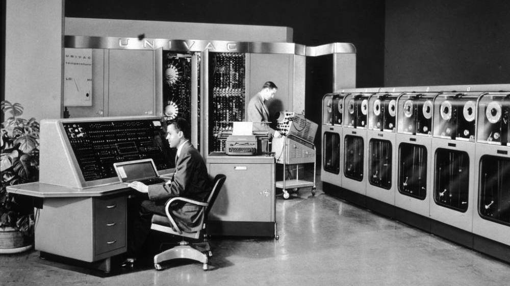
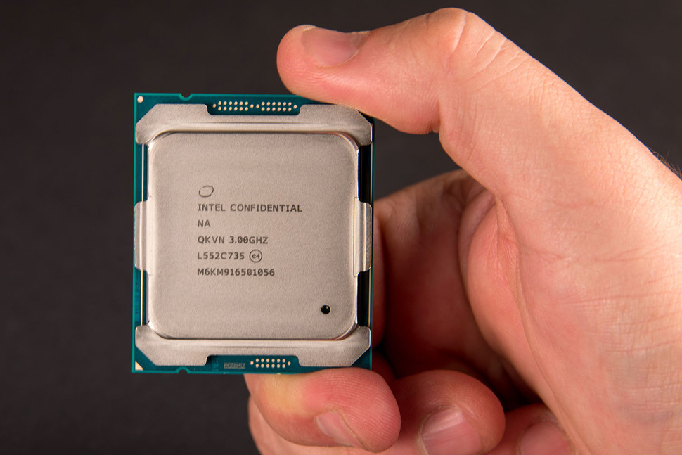

..  Copyright (C)  Mark Guzdial, Barbara Ericson, Briana Morrison
    Permission is granted to copy, distribute and/or modify this document
    under the terms of the GNU Free Documentation License, Version 1.3 or
    any later version published by the Free Software Foundation; with
    Invariant Sections being Forward, Prefaces, and Contributor List,
    no Front-Cover Texts, and no Back-Cover Texts.  A copy of the license
    is included in the section entitled "GNU Free Documentation License".

..      qnum::
        :start: 1
        :prefix: csp-22-1-

Global Impact
====================

*Learning Objectives:*

- Explain how computing innovations affect communication, interaction, and cognition.
- Explain how people participate in a problem-solving process that scales.
- Explain how computing has impacted innovations in other fields.
- Analyze the beneficial and harmful effects of computing.
- Explain the connections between computing and economic, social, and cultural contexts.
- Access, manage, and attribute information using effective strategies.
- Evaluate online and print sources for appropriateness and credibility.

The rapid evolution of computing in the last century has transformed our world. Industries in every field are becoming more and more productive and efficient. Calculations of huge data-sets can be made in seconds and repetitive tasks are optimized and automated. Gordon Moore, the co-founder of Intel, once defined a law stating that processing power will double every eighteen months. While this law does not exactly apply to the same time intervals today, computing power continues to increase exponentially. Computers used to fill whole rooms and nowadays we have chips in kitchen tools, cars, and of course our mobile phones. Click `here <https://www.technologyreview.com/s/601441/moores-law-is-dead-now-what/>`_ for more information about Moore's Law more recent uses.

1960 UNIVAC (Universal Automatic Computer) -- from NPR's article: `The First Supercomputer vs. The Desk Set <http://www.npr.org/2011/06/19/137280862/the-first-supercomputer-vs-the-desk-set>`_

2016 Intel Broadwell-E Processor -- from Digital Trends article: `Intel Broadwell-E Announcement <https://www.digitaltrends.com/computing/intel-broadwell-e-announcement/>`_

.. mchoice:: 22_1_1_MooreQ1
                :answer_a: It is outdated, as processing power no longer increases.
                :answer_b: It allows for computing industries to effectively plan for future development.
                :answer_c: Moore's law is extremely useful, because it will always be a dependable tool for industries to use.
                :answer_d: All of the above.
                :correct: b
                :feedback_a: While processing power is not increasing at the same exponential rate it used to increase at, it still increases exponentially.
                :feedback_b: Many industries use Moore's law to determine the magnitude of computing power in the future.
                :feedback_c: This is false because Moore's law is expected to end around 2020 due to transistors being unable to be shrunk further.
                :feedback_d: This is false because two of the options are false.

                Which of the following are true about Moore's Law?

With the internet, computer scientists and engineers have enabled a new form of human interconnectivity that impacts our daily lives through areas such as education, travel, the environment, and politics. The fact that this eBook is teaching you about computer science shows how education is evolving to be accessible worldwide and free of charge. Social networks have been catalysts for uprisings in the Middle East where oppressed people can utilize these platforms to call for greater freedom and democracy in their countries. The ability to translate content in every language in seconds is connecting people worldwide. With new forms of communication via chats, video calls and collaboration platforms, the internet allows us to work together globally and stay informed about challenges worldwide.

However, the global effects of computing can also be harmful for people and society. Companies that want to improve their customer experience or advertisement strategy  can collect personal data which raises data protection and privacy issues. With thousands of new electrical gadgets on the market everyday, the generation of clean energy and development of effective recycling becomes more and more urgent. The "Digital Divide" suggests how segments of society struggle to participate in the new technologically influenced economy. For example, the elderly, poor, and disabled struggle to access technology. Such rising challenges encourage innovative solutions and policies that will protect human rights and economic competition between new company giants.

.. mchoice:: 22_1_2_MooreQ1    
       		   :answer_a: I, II
       		   :answer_b: I, III
       		   :answer_c: III, IV
      		   :answer_d: I, II, III, IV
       		   :correct: b
       		   :feedback_a: Privacy has decreased due to computing, as companies can more easily access your personal data.
       		   :feedback_b: Computing has increased the ability to communicate around the world, and has made information readily available through the internet.
       		   :feedback_c: Certain groups of people (i.e. elderly, poor) have difficulty accessing technology.
       		   :feedback_d: Two of these options are not true.

       		   Which of the following are positive effects of computing?

        	    | I. Global Communication
        	    | II. Increased Privacy
        	    | III. More Accessible Information
        	    | IV. Equal Accessibility for all Groups of People

Computing power and intelligent algorithms help to develop new innovations that are faster and scalable.  By learning creative and logical problem solving, you can use your coding powers to have an impact on your community and the world.
