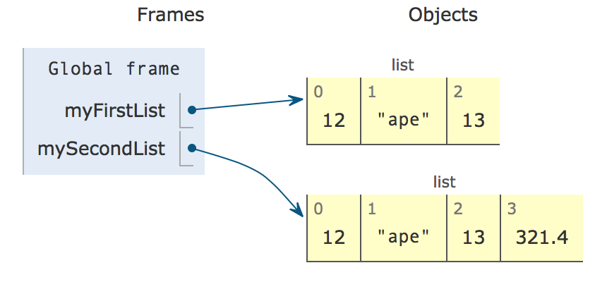

..  Copyright (C)  Mark Guzdial, Barbara Ericson, Briana Morrison
    Permission is granted to copy, distribute and/or modify this document
    under the terms of the GNU Free Documentation License, Version 1.3 or
    any later version published by the Free Software Foundation; with
    Invariant Sections being Forward, Prefaces, and Contributor List,
    no Front-Cover Texts, and no Back-Cover Texts.  A copy of the license
    is included in the section entitled "GNU Free Documentation License".

.. setup for automatic question numbering.
    
.. 	qnum::
	:start: 1
	:prefix: csp-16-4-
      
Working with Indexes
=====================
	
.. index:: 
	pair: list; index
	
To access individual items in a collection (a list or a string), we can use an **index**.  Each item in a collection has a number associated with it -- think of it as the item's address in the collection.  The first item in a collection has index ``0``, the next one ``1``, and so on.  See the image below for a view of two lists with the *index* for each list item shown at the top of each yellow box and the *value* for that index shown at the bottom of each yellow box.

    Figure 2: Lists and their indicies

We use square brackets to access items of the list, e.g., ``myList[0]`` will return the first item in the list.

.. mchoice:: 16_4_1_lastIndex
   :answer_a: 0
   :answer_b: 1
   :answer_c: 2
   :answer_d: 3
   :correct: c
   :feedback_a: This is the index of the first item in the list.
   :feedback_b: This is the index of the second item in the list.  
   :feedback_c: This is the index of the last item in this list since it contains 3 items and the first index is 0.   
   :feedback_d: The length of this list is 3, but the first index is 0 so the 3rd item is at index 2.

   What is the last index for the list ``myFirstList``?

.. mchoice:: 16_4_2_valueLastIndex
   :answer_a: 12
   :answer_b: "ape"
   :answer_c: 13
   :answer_d: 321.4
   :correct: d
   :feedback_a: This is the value at index 0. 
   :feedback_b: This is the value at index 1.  
   :feedback_c: This is the value at index 2.
   :feedback_d: This is the value at index 3.

   What is the value of the item at index 3 in mySecondList?

You can access individual items of a list just like they were variables.  Using ``list[index]`` on the right side of an assignment returns the value at that index in the list. Using ``list[index]`` on the left side of an assignment statement changes the value at that index in the list.

.. codelens:: Items_As_Variables
  :showoutput:

  items = [2,4,6,8]
  items[0] = "First item"
  items[1] = items[0]
  items[2] = items[2] + 1
  print(items)

.. mchoice:: 16_4_3_ItemsAsVariablesQ
	:answer_a: items[0]
	:answer_b: items[1]
	:answer_c: items[2]
	:answer_d: items[3]
	:correct: d
	:feedback_a: Originally, <code>items[0]</code> was 2, but then we set it to the string: <code>"First item"</code>
	:feedback_b: We set <code>items[1]</code> to be the same as <code>items[0]</code>: <code>"First item"</code>
	:feedback_c: We incremented <code>items[2]</code> in line 4.
	:feedback_d: The value at <code>items[3]</code> doesn't change.  It still equals 8.

	Of the four items in the list named ``items``, which one is not changed in the program above?
	
.. mchoice:: 16_4_4_addLists
   :practice: T
   :answer_a: [3, 2, 1]
   :answer_b: [2, 0, 2]
   :answer_c: [2, 2, 2]
   :answer_d: [2, 2, 1]
   :correct: c
   :feedback_a: That is the original contents of <code>values</code>, but the contents are changed. 
   :feedback_b: When you set <code>values[0]</code> to <code>values[1]</code> it makes a copy of the value and doesn't zero it out.
   :feedback_c: The value at index 0 is set to a copy of the value at index 1 and the value at index 2 is incremented.
   :feedback_d: Notice that we do change the value at index 2.  It is incremented by 1.
	
   What would the following code print?
	   
   :: 
   
      values = [3, 2, 1]
      values[0] = values[1]
      values[2] = values[2] + 1
      print(values)
	
.. note::

    Discuss topics in this section with classmates. 

      .. disqus::
          :shortname: cslearn4u
          :identifier: studentcsp_16_4

