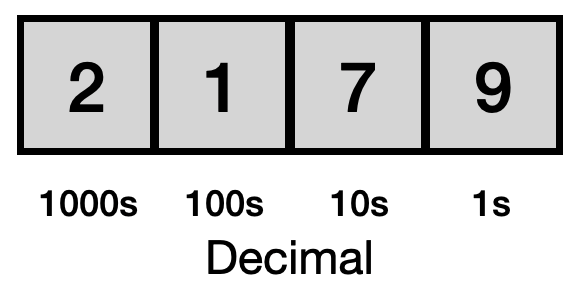
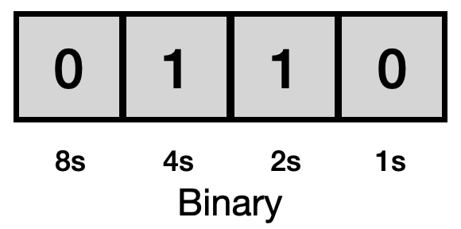
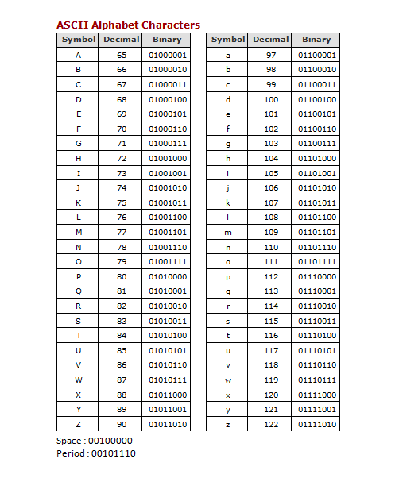

..  Copyright (C)  Stacey Watson
    Permission is granted to copy, distribute and/or modify this document
    under the terms of the GNU Free Documentation License, Version 1.3 or
    any later version published by the Free Software Foundation; with
    Invariant Sections being Forward, Prefaces, and Contributor List,
    no Front-Cover Texts, and no Back-Cover Texts.  A copy of the license
    is included in the section entitled "GNU Free Documentation License".

.. setup for automatic question numbering.

.. 	qnum::
	:start: 1
	:prefix: csp-2-3-

It's All Bits
=============

..	index::
	single: ASCII
	single: binary
	single: bit
	single: byte
	single: character

Number Systems
--------------

The common **decimal** number system is based on ten numbers from 0 to 9. When we want to count higher than 9, we add additional digits to the left and multiply by ten each time. For example, in figure 1 below, we see a 9 in the ones position, a 7 in the tens position, a 1 in the hundreds position and a 2 in the thousands position. We would then multiply each digit by its position multiplier and add them all up to calculate our number: *(2 * 1000) + (1 * 100) + (7 * 10) + (9 * 1) = 2000 + 100 + 70 + 9 = 2179*

    Figure 1: Decimal Number System

Computers use a **binary** number system, which means that everything is represented by two values: 0 and 1. These two values are combined to form letters, words, images, and everything else that shows up on your screen, but they also are used to represent states, such as on (1) or off (0) or the size of your RAM memory or magnetic disk.

We can also count to any number in binary, by combining the two numbers 0 and 1, just as we do in decimal. However, rather than multiplying by ten each time we add a number to the sequence, we multiply by two. For example, in figure 2 below, we see a 0 in the ones position, a 1 in the twos position, a 1 in the fours position, and a 0 in the eights position. We would then multiply each value by its position multiplier and add them all up to calculate our number: *(0 * 8) + (1 * 4) + (1 * 2) + (0 * 1) = 0 + 4 + 2 + 0 = 6*

    Figure 2: Binary Number System

You can try this with the below Binary Calculator. Go ahead and click on the box grey boxes in the twos and fours positions to verify that the calculator works correctly.

.. raw:: html

	
<iframe src="https://binarycalculator.netlify.app" style="border:0px #ffffff none;" name="myiFrame" scrolling="yes" frameborder="1" marginheight="0px" marginwidth="0px" height="400px" width="600px" allowfullscreen></iframe>

.. fillintheblank:: 2_3_1_itsallbits_Q1

		 What is the 8-bit binary code for number 12? Use the above Binary Calculator. |blank|

		 - :00001100: Correct!
		   :x: Try again!

.. fillintheblank:: 2_3_2_itsallbits_Q2

		 What is the maximum decimal value that can be expressed with 8 bits? Use the above Binary Calculator to find out! |blank|

		 - :255: Correct!
		   :x: Try again!

Bits and Bytes
--------------

Since the word digit comes from the practice of counting on our ten fingers and toes, early computer scientists needed another word to represent each 0 or 1 in a sequence. A **bit** or **binary digit** is a single 0 or 1 and is the smallest piece of information that a computer can store. A sequence of eight bits, such as 10010001 is called a **byte**. If you use the Binary Calculator above, you will see that the byte 10010001 is equal to 145.

Every time you save a document, image or video file, your computer writes a sequence of binary numbers to a storage device. You may be wondering how these 0's and 1's turn into numbers, letters, and words.

In essence, each item on your keyboard, be it a symbol, letter, or number is a **character** with a unique binary number. The American Standard Code for Information Interchange or **ASCII**, which was developed in 1963, portrays 95 characters with eight bits or one byte of information.

It gets more complicated when computers are representing media such as audio, video or images, but for the moment, it is enough to understand that all data on a computer is represented by 0s and 1s.

    Figure 3: ASCII Codes for Common Characters

		.. fillintheblank:: 2_3_3_itsallbits_Q3

		   What is the 8-bit binary code for the upper-case B? Use the above ASCII table. |blank|

		   - :01000010: Correct!
		     :x: Try again!

		.. fillintheblank:: 2_3_4_itsallbits_Q4

		 	 What two-letter word does the following sequence of bits represent? Use the above ASCII table. 01110100 01101111 |blank|

			 - :to: Correct!
			   :x: Try again!
