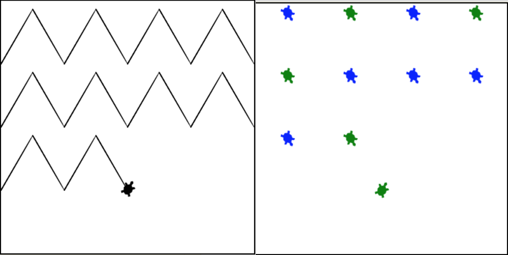

..  Copyright (C)  Mark Guzdial, Barbara Ericson, Briana Morrison
    Permission is granted to copy, distribute and/or modify this document
    under the terms of the GNU Free Documentation License, Version 1.3 or
    any later version published by the Free Software Foundation; with
    Invariant Sections being Forward, Prefaces, and Contributor List,
    no Front-Cover Texts, and no Back-Cover Texts.  A copy of the license
    is included in the section entitled "GNU Free Documentation License".

.. 	qnum::
	:start: 1
	:prefix: csp-14-4-

Using Random Numbers
======================

..	index::
    pair: random; randrange

We can generate random numbers in Python using the ``randrange`` function in the ``random`` library.  This function takes an optional starting value (inclusive) and the ending value for the range (exclusive).  We can use random numbers in games to add an element of chance.  We can also use random numbers to move the turtle to random positions as shown below.  We are using conditionals to alternate the drawing color each time the turtle moves.  

.. activecode:: td_scribble
    :tour_1: "Structural Tour"; 1-2: td3-line1-2; 3-5: td3-line3-5; 6-9: td3-line6-9; 10: td3-line10; 11: td3-line11; 12-13: td3-line12-13; 14-15: td3-line14-15; 16-18: td3-line16-18; 
    :nocodelens:

    from turtle import *      # use the turtle library
    import random 
    space = Screen()          # create a turtle screen (space)
    width = space.window_width()
    height = space.window_height()
    maxX = width / 2  # get the max x value
    minX = -1 * maxX
    maxY = height / 2 
    minY = -1 * maxY
    jaz = Turtle()            # create a turtle named jaz
    for num in range(10):
    	if num % 2 == 0:             # if even row
        	jaz.color('red')          # set the color to red
       	if num % 2 == 1:             # if odd row
        	jaz.color('black')       # set the color to black
       	randX = random.randrange(minX, maxX)
       	randY = random.randrange(minY, maxY)
       	jaz.goto(randX,randY)
       	
Can you modify the code above to use 3 different colors?  You can use ``num % 3`` to give you 3 possible results.  
       
.. mchoice:: 14_4_1_randrange1
   :answer_a: randX = random.randrange(minX, maxX)
   :answer_b: randX = random.randrange(0, maxX)
   :answer_c: randX = random.randrange(minX, 0)
   :correct: c
   :feedback_a: This will range from the minimum x value (inclusive) to the maximum x value (exclusive).  It will cover the whole width of the drawing area.
   :feedback_b: This will range from 0 to the maximum x value (exclusive).  It will cover the right half of the drawing area.
   :feedback_c: This will range from the minimum x value (inclusive) to 0.  It will cover the left half o the drawing area.

   What could you use to limit the x values to just the left half of the drawing space (screen)? 

.. tabbed:: 14_4_2_WSt

        .. tab:: Question

           In the first section this chapter we created the chevron image on the left using turtles. Modify the code to create the stampped image on the right. The turtles will stamp/draw in blue and green. The color will be chosen at random.
           
           .. activecode::  14_4_2_WSq
               :nocodelens:

               from turtle import *      
               from sys import *         
               setExecutionLimit(50000)  
               space = Screen()          

               width = 400               
               space.setup(width,width)  
               maxX = width / 2          

               jaz = Turtle()            
               jaz.shape('turtle')       
               jaz.penup()               
               jaz.goto(-1 * maxX,100)   
               jaz.pendown()             
               jaz.left(60)              

               for x in range(10):       
                   jaz.forward(100)           
                   jaz.right(120)             
                   jaz.forward(100)           
                   jaz.left(120)              
                   if (jaz.xcor() >= maxX):   
                       jaz.penup()                
                       jaz.goto(-1 * maxX,jaz.ycor() - 100)  
                       jaz.pendown()              

        .. tab:: Answer
            
          .. activecode::  14_4_2_WSa
              :nocodelens:

              # CREATE THE TURTLE WORLD
              from turtle import *      
              import random
              from sys import *         
              setExecutionLimit(50000)  
              space = Screen()          

              # SET UP THE SCREEN SIZE
              width = 400               
              space.setup(width,width)  
              maxX = width / 2          

              # MOVE TURTLE TO STARTING POSITION
              jaz = Turtle()            
              jaz.shape('turtle')       
              jaz.penup()              
              jaz.goto(-1 * maxX,100)   
              jaz.pendown()
              jaz.left(60)              

              # DRAW THE CHEVRON DESIGN
              for x in range(10):       
                rand = random.randrange(0, 2)
                if (rand == 0):
                  jaz.color("green")
                else:
                  jaz.color("blue")
                jaz.forward(100)           
                jaz.right(120)             
                jaz.stamp()
                jaz.forward(100)           
                jaz.left(120)              
                if (jaz.xcor() >= maxX):   
                  jaz.penup()                
                  jaz.goto(-1 * maxX,jaz.ycor() - 100)  
                  jaz.pendown()

                                            
        .. tab:: Discussion 

            .. disqus::
                :shortname: cslearn4u
                :identifier: studentcsp_14_4_2_WSq

.. note::

    Discuss topics in this section with classmates. 

      .. disqus::
          :shortname: cslearn4u
          :identifier: studentcsp_14_4

      
