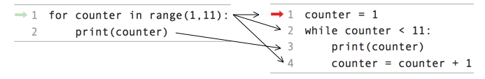

..  Copyright (C)  Mark Guzdial, Barbara Ericson, Briana Morrison
    Permission is granted to copy, distribute and/or modify this document
    under the terms of the GNU Free Documentation License, Version 1.3 or
    any later version published by the Free Software Foundation; with
    Invariant Sections being Forward, Prefaces, and Contributor List,
    no Front-Cover Texts, and no Back-Cover Texts.  A copy of the license
    is included in the section entitled "GNU Free Documentation License".

.. 	qnum::
	:start: 1
	:prefix: csp-8-3-

.. highlight:: java
   :linenothreshold: 4

Counting with a While Loop
===========================

It's easy to have the computer repeat something a specific number of times.  We have done this with a ``for`` loop and a list of numbers created with the ``range`` function as shown below.

.. codelens:: for_counter_8_3

	for counter in range(1,11):
	    print(counter)

We can also do it with a ``while`` loop.

For example, we could have a computer count up from 1 to 10.  We will use a ``counter`` variable that we will **increment** inside the loop.  **Increment** means increase the value by one.  Note that we continue the loop as long as the ``counter`` is less than the desired last value plus one.

.. codelens:: while_count

   counter = 1
   while counter < 11:
       print(counter)
       counter = counter + 1

.. mchoice:: 8_3_1_While_Count_Q1
   :answer_a: 1
   :answer_b: 10
   :answer_c: 11
   :correct: c
   :feedback_a: Counter is incremented each time the loop executes.
   :feedback_b: The last value to be printed is 10.  But, the counter is incremented after the current value is printed.
   :feedback_c: Counter gets incremented to 11 after printing, and then the while loop tests counter, finds counter is not less than 11 and then continues after the body of the loop.

   What is the value of counter after the loop finishes executing?

.. mchoice:: 8_3_2_NegativeCounter
   :practice: T
   :answer_a: 5 4 3 2 1
   :answer_b: -5 -4 -3 -2 -1
   :answer_c: -4 -3 -2 -1 0
   :correct: c
   :feedback_a: If x starts at -5 how can the first value printed be 5?
   :feedback_b: This would be true if the print statement was before we incremented x.
   :feedback_c: The value of x is incremented before it is printed so the first value printed is -4.

   What does the following code print?

   ::

      output = ""
      x = -5
      while x < 0:
          x = x + 1
          output = output + str(x) + " "
      print(output)

Side by Side Comparison of a For Loop and a While Loop
-------------------------------------------------------

Let's look at these loops side by side.  The first line in the ``for`` loop creates the variable ``counter`` and the list of values from 1 to 10.  It then sets ``counter`` equal to 1 and executes the body of the loop.  In the body of the loop it prints the current value of ``counter`` and then changes ``counter`` to the next value in the list.

The first line of the ``while`` loop creates the variable ``counter`` and sets its value to 1.  The second line tests if the value of ``counter`` is less than 11 and if so it executes the body of the loop.  The body of the loop prints the current value of ``counter`` and then increments the value of ``counter``.  The loop will stop repeating when ``counter`` is equal to 11.

    Figure 1: A for loop and the equivalent while loop

Which is the **best** loop to use when you want to execute a loop a known number of times?  Which way uses less code or seems less error prone?  The problem with using a ``while`` loop to repeat code a specific number of times is that you may forget to change the value that you are testing inside the body of the loop and in that case you will have an infinite loop.

The following code is an attempt to show another way to print the values from 1 to 10.  **However, it currently has an error and is an infinite loop**.  Fix the code below so that it isn't an infinite loop.

.. activecode:: while_counter_infinite

   counter = 1
   while counter <= 10:
       print(counter)
   counter = counter + 1

.. parsonsprob:: 8_3_3_While_Countdown
   :numbered: left
   :adaptive:

   The following is the correct code for printing a countdown from 10 to 0, but it is mixed up. Drag the blocks from the left and put them in the correct order on the right.  Don't forget to indent blocks in the body of the loop.  Just drag the block to the further right to indent.  Click the <i>Check Me</i> button to check your solution.

   -----
   counter = 10
   while counter >= 0:
       print(counter)
       counter = counter - 1

.. index::
	pair: statements; for
	single: definite loop

.. parsonsprob:: 8_2_4_While_Count_Even
   :numbered: left
   :adaptive:

   The following is the correct code for printing the even numbers from 0 to 10, <b>but it also includes some extra code that you won't need</b>. Drag the needed blocks from the left and put them in the correct order on the right.  Don't forget to indent blocks in the body of the loop.  Just drag the block to the further right to indent.  Click the <i>Check Me</i> button to check your solution.

   -----
   counter = 0
   =====
   while counter <= 10:
   =====
       print(counter)
   =====
       counter = counter + 2
   =====
       counter = counter + 1 #distractor

.. tabbed:: 8_3_5_WSt

        .. tab:: Question

           Use a while loop to count from 5 to 9. Print the current value in the counter at every interation in the loop.

           .. activecode::  8_3_5_WSq
                :nocodelens:

        .. tab:: Answer

          .. activecode::  8_3_5_WSa
              :nocodelens:

              # INITIALIZE COUNTER
              counter = 5
              # SET LOOP CONDITION
              while counter < 10 :
                # PRINT CURRENT VALUE
                print(counter)
                counter = counter + 1

        .. tab:: Discussion

            .. disqus::
                :shortname: cslearn4u
                :identifier: studentcsp_8_3_5_WSq

.. note::

    Discuss topics in this section with classmates.

      .. disqus::
          :shortname: cslearn4u
          :identifier: studentcsp_8_3
