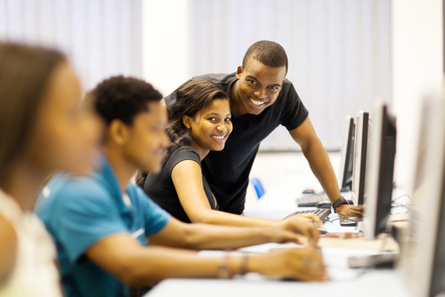

..  Copyright (C)  Mark Guzdial, Barbara Ericson, Briana Morrison
    Permission is granted to copy, distribute and/or modify this document
    under the terms of the GNU Free Documentation License, Version 1.3 or
    any later version published by the Free Software Foundation; with
    Invariant Sections being Forward, Prefaces, and Contributor List,
    no Front-Cover Texts, and no Back-Cover Texts.  A copy of the license
    is included in the section entitled "GNU Free Documentation License".

..  shortname:: Chapter: What You Can Do with a Computer
..  description:: Some tidbits of what you can do with a computer

.. setup for automatic question numbering.

.. 	qnum::
	:start: 1
	:prefix: csp-1-1-

.. |runbutton| image:: Figures/run-button.png
    :height: 20px
    :align: top
    :alt: run button

.. |audiobutton| image:: Figures/start-audio-tour.png
    :height: 20px
    :align: top
    :alt: audio tour button

This Book is for Students
==========================

This chapter introduces the approach used in this book and offers some quick "teasers" of things we'll be doing later.  **Don't worry if you don't understand the code (programs - instructions that a computer can understand) that you see in this chapter**.  We'll go through things much more slowly in the next few chapters.  This book is intended for students who haven't programmed before.  If you are a teacher then send email to cslearn4u@gmail.com to get access to the teacher edition of this book which contains several features just for teachers.

Please fill out the survey at https://www.surveymonkey.com/r/studentCSP-pre. It will help us with our research.  You might want to open that link in another tab to make it easier for you to get back to the ebook.

..	index::
	single: Python
	single: code
	single: program

This electronic book is different because it uses *examples plus practice*.  Most computer science books are about becoming professional software developers (people who write programs for a living).  Most computer science courses require you to write lots of code.  This book helps students learn how *programming* without making you write lots of code.  It will use the programming language **Python** which is used by companies like Google and Pixar.  

    Figure 1: Students in a computer classroom

- Rather than have you write lots of code, we will ask you to *read* a lot of code *examples*.
- We ask you to *use* what you are learning from the examples in some simple *practice* exercises.  These exercises are meant to be short and easy.
- **You don't have to install anything**.  You will read, edit, and run programs all from within the pages of this ebook inside the browser.  

Click the arrow at the bottom right side of this window to go on to the next section in this chapter.  Click on the name of the book at the top left of the page to go to the table of contents.

